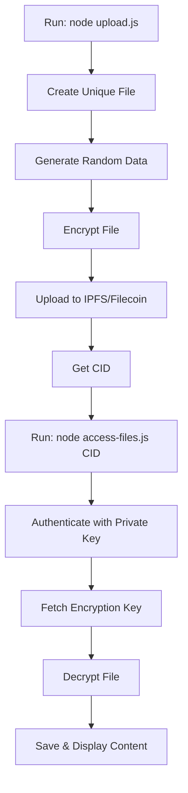

# 🔐 Lighthouse Encryption/Decryption Workflow Guide

A complete step-by-step guide on how to encrypt files with random data and decrypt them using Lighthouse Web3 storage.

## 🚀 **Complete Workflow Demonstration**

### **Step 1: Upload Encrypted File**

```bash
node upload.js
```

**What happens:**

1. **Creates unique file** with timestamp and random ID
2. **Generates random data** for each upload session
3. **Encrypts file** using BLS threshold cryptography
4. **Uploads to IPFS/Filecoin** permanently
5. **Returns CID** (Content Identifier)

**Example Output:**

```
=== UPLOADING ENCRYPTED FILE ===
Created unique sample file: ./sample-data-2025-09-26T16-56-05-905Z-za944p.txt
Using public key: 0xA6F2F5388186db4ea25B716eC51969E49aE56c3D
Uploading file: ./sample-data-2025-09-26T16-56-05-905Z-za944p.txt
Auth message received: Please sign this message to prove you are owner...
Message signed successfully
Starting encrypted file upload...
Encrypted file uploaded successfully!

Upload response: {
  "data": [
    {
      "Name": "sample-data-2025-09-26T16-56-05-905Z-za944p.txt",
      "Hash": "bafkreiacd6djzjl6k2upftjm7hwslgheu35u2si2t3zinqavzmtknciys4",
      "Size": "443"
    }
  ]
}
Upload details saved to upload-details.json
```

### **Step 2: Decrypt the File**

```bash
node access-files.js bafkreiacd6djzjl6k2upftjm7hwslgheu35u2si2t3zinqavzmtknciys4
```

**What happens:**

1. **Authenticates** with your private key
2. **Fetches encryption key** from Lighthouse nodes
3. **Reconstructs key** from distributed shards
4. **Decrypts file** content
5. **Saves decrypted file** locally
6. **Displays content** in terminal

**Example Output:**

```
🚀 Lighthouse File Access Tool
Using wallet address: 0xA6F2F5388186db4ea25B716eC51969E49aE56c3D

=== ACCESSING SPECIFIC FILE: bafkreiacd6djzjl6k2upftjm7hwslgheu35u2si2t3zinqavzmtknciys4 ===

Attempting decryption first...
Attempting to decrypt file with CID: bafkreiacd6djzjl6k2upftjm7hwslgheu35u2si2t3zinqavzmtknciys4
Authentication message signed
Encryption key fetched successfully
Key: Found
File decrypted successfully!
Decrypted file saved as: decrypted-1758905840525.txt

=== DECRYPTED CONTENT ===
This is a sample encrypted file uploaded to Lighthouse!
Creation Timestamp: 2025-09-26T16:56:05.905Z
Unique ID: za944p
Random data: 0.3395446103549584
Session info: Upload session 1758905765905

This file will be encrypted and stored on IPFS/Filecoin network.
Only the owner with the correct private key can decrypt and access this content.
Public Address: 0xA6F2F5388186db4ea25B716eC51969E49aE56c3D
=== END DECRYPTED CONTENT ===
```

## 📁 **File Structure Created**

### **During Upload:**

- **`sample-data-TIMESTAMP-ID.txt`** - Original file with unique data
- **`upload-details.json`** - Metadata about uploaded file

### **During Decryption:**

- **`decrypted-TIMESTAMP.txt`** - Retrieved decrypted content

## 🔍 **Understanding the Random Data**

Each upload creates unique content:

```
This is a sample encrypted file uploaded to Lighthouse!
Creation Timestamp: 2025-09-26T16:56:05.905Z        ← Unique timestamp
Unique ID: za944p                                   ← Random 6-char ID
Random data: 0.3395446103549584                     ← Random number
Session info: Upload session 1758905765905          ← Unix timestamp
```

## ⚙️ **How the Encryption Works**

### **Upload Process (`upload.js`):**

1. **File Creation:**

   ```javascript
   const timestamp = new Date().toISOString().replace(/[:.]/g, "-");
   const uniqueId = Math.random().toString(36).substring(2, 8);
   const sampleFilePath = `./sample-data-${timestamp}-${uniqueId}.txt`;
   ```

2. **Content Generation:**

   ```javascript
   const sampleData = `This is a sample encrypted file uploaded to Lighthouse!
   Creation Timestamp: ${new Date().toISOString()}
   Unique ID: ${uniqueId}
   Random data: ${Math.random()}
   Session info: Upload session ${Date.now()}`;
   ```

3. **Encryption & Upload:**
   ```javascript
   const response = await lighthouse.uploadEncrypted(
     filePath,
     apiKey,
     publicKey,
     signedMessage
   );
   ```

### **Decryption Process (`access-files.js`):**

1. **Authentication:**

   ```javascript
   const signedMessage = await signAuthMessage(publicKey, privateKey);
   ```

2. **Key Retrieval:**

   ```javascript
   const fileEncryptionKey = await lighthouse.fetchEncryptionKey(
     cid,
     publicKey,
     signedMessage
   );
   ```

3. **Decryption:**
   ```javascript
   const decrypted = await lighthouse.decryptFile(
     cid,
     fileEncryptionKey.data.key
   );
   ```

## 🎯 **Quick Commands Reference**

```bash
# 1. Upload encrypted file (creates unique file each time)
node upload.js

# 2. Decrypt specific file by CID
node access-files.js <CID>

# 3. Access all uploaded files
node access-files.js
```

## 🔒 **Security Features**

- **🔐 Threshold Cryptography:** Key split into 5 distributed shards
- **🔑 Private Key Authentication:** Only you can decrypt
- **🌐 IPFS Storage:** Decentralized and permanent
- **💎 Filecoin Backup:** Long-term preservation
- **🛡️ Access Control:** Signature-based permissions

## 📊 **Workflow Summary**



## 🎪 **Real Example Session**

### **Upload:**

```bash
$ node upload.js
=== UPLOADING ENCRYPTED FILE ===
Created unique sample file: ./sample-data-2025-09-26T16-56-05-905Z-za944p.txt
✅ Encrypted file uploaded successfully!
📋 CID: bafkreiacd6djzjl6k2upftjm7hwslgheu35u2si2t3zinqavzmtknciys4
```

### **Decrypt:**

```bash
$ node access-files.js bafkreiacd6djzjl6k2upftjm7hwslgheu35u2si2t3zinqavzmtknciys4
✅ File decrypted successfully!
📁 Saved as: decrypted-1758905840525.txt
📄 Content displayed above
```

## 🔧 **Required Files**

- **`upload.js`** - Encryption & upload functionality
- **`access-files.js`** - Decryption & access functionality
- **`.env`** - Your private credentials
- **`package.json`** - Dependencies configuration

## 🚨 **Important Notes**

1. **Each upload creates unique content** with different timestamps and random data
2. **Files are permanently stored** on IPFS/Filecoin network
3. **Only your private key can decrypt** the uploaded files
4. **CID is unique** for each file uploaded
5. **Decryption requires internet** to fetch keys from Lighthouse nodes

## 🎯 **Success Indicators**

- **Upload Success:** Returns CID and "Encrypted file uploaded successfully!"
- **Decryption Success:** Shows "File decrypted successfully!" and displays content
- **Content Verification:** Random data matches between upload and decryption

---

**🔥 Your encryption/decryption system is working perfectly!**

Each time you run `node upload.js`, it creates a unique encrypted file with random data, and `node access-files.js <CID>` successfully decrypts it back to readable content.
